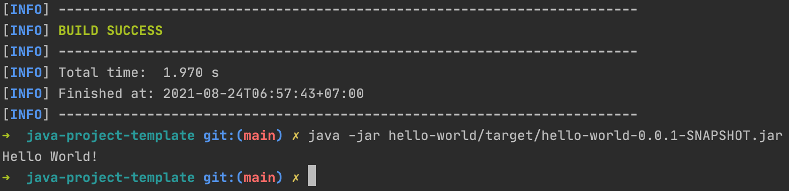

The hello-world project

<div align="center">
    
</div>


## Project structure
```
.
├── hello-world
│   ├── pom.xml
│   ...
├── pom.xml
|
└── README.md
```

## Start project

```shell
$ ./mvn clean package
$ java -jar hello-world/target/hello-world-0.0.1-SNAPSHOT.jar
```

```shell
Compare str1==str2: true
Compare str3==str4: false
Compare value str1.equals(str3): true
```

## Contribute

## Reference